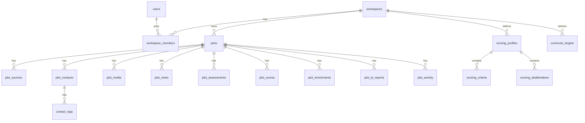
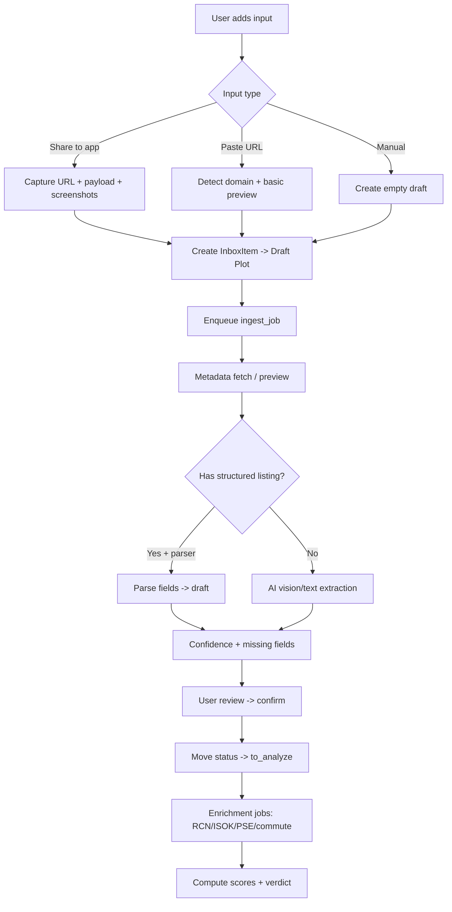
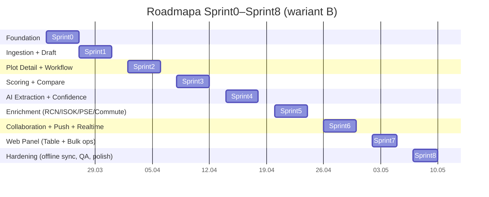

# Decision Engine do działek budowlanych (mobile + web) — Deep Research Report

> Wersja: 1.0 | Data: 2026-03-21
> Opracowano na podstawie sesji discovery z Wojtkiem i Sabiną + automatyczny research Claude Deep Research.

---

## Executive Summary

Budujecie **prywatny (na start)** system decyzyjny do zakupu działki, który może być później „produktyzowany" dla znajomych (multi-workspace + invite), ale MVP musi dowieźć cztery rzeczy: **intake → normalizacja → ocena/ryzyko/wycena → porównanie i decyzja**.

Największy czynnik ryzyka (i jednocześnie przewaga) to **Facebook jako kanał discovery**. Oficjalne API grup FB jest dziś złym fundamentem (deprecacje w Graph API v19), więc architektura intake powinna opierać się na **share-to-app na mobile + fallback paste + screenshoty**, a nie na „czytaniu grup" po API lub scrapingu.

Warstwa danych w Polsce ma realny potencjał: **RCN z Geoportalu** (WMS/WFS) + dane przestrzenne (BDOT10k, ortofoto, NMT) + **ISOK/Wody** dla powodzi + warstwy zewnętrzne (np. **PSE** dla sieci najwyższych napięć) – ale wymaga to integracji opartej o **konfigurowalne endpointy i tolerancję zmian adresów usług**.

Rekomendowana architektura: **Expo/React Native jako core** (intake, teren, offline, push) + **Next.js web panel** (tabela 50–100 działek, porównania, edycja hurtowa) + **Supabase** (Postgres, RLS, Realtime, Storage, Edge Functions) + AI (Claude/OpenAI) z naciskiem na **structured outputs** i **confidence**.

---

## Strategia produktu i PRD v1

### Kontekst i założenia

| Obszar | Ustalenie |
|---|---|
| Primary user | Wojtek + Sabina (wspólna decyzja) |
| Cel | Zakup działki: redukcja chaosu + formalne i rynkowe ryzyka + ranking opcji |
| Zasięg geograficzny | ~10 km wokół Rzeszów lub Krosno (modyfikowalne w Settings) |
| Docelowe platformy | iOS + Android (mobile-first), web panel pomocniczy |
| Produkt publiczny | Możliwy później, ale MVP: prywatny workspace + opcjonalnie „znajomi" |
| Dane krytyczne | źródła ofert, kontakty, log kontaktu, status procesu, scoring, mapy/ryzyka, wycena vs okolica |

### PRD v1: MVP (wariant B, 4–6 tygodni)

**Job-to-be-done:** „Dodaję działkę w 30–60 sekund i natychmiast widzę: *czy warto ją dalej cisnąć*, *jakie są ryzyka*, *jak stoi cenowo do okolicy*, oraz *jak wypada względem shortlisty*."

**MVP must-have:**
1. **Intake linków**: Facebook (share-to-app) + fallback paste + screenshoty; portale (Otodom/OLX/Adresowo/Gratka) przez link + preview + manual uzupełnienie.
2. **Draft flow**: Inbox → Draft → „Do analizy" (AI) → „Do obejrzenia" → „Po obejrzeniu" → Due diligence → Shortlist/Top3 → Odrzucona/Kupujemy.
3. **Encje: Source, Contacts, Contact Logs** (z RLS i sharingiem w workspace).
4. **Karta działki (Plot Detail)**: dane, zdjęcia, mapa, dojazdy, ryzyka, scoring (Wojtek/Sabina/wspólny), AI verdict i „pytania do sprzedającego".
5. **Porównanie**: tabela (bulk) + premium cards (top shortlist).
6. **Offline**: lokalny cache + outbox sync + konflikt resolution (last-write-wins + changelog).
7. **Push**: powiadomienia o dodaniu/zmianie działki w workspace (Expo → APNs/FCM).
8. **Enrichment v1**: RCN (jeśli dostępne) + flood risk (ISOK/Wody) + PSE warstwy + podstawowe travel times.

**MVP non-goals:**
- „Pełnego" czytania grup FB przez API / scraping.
- Automatycznej analizy prawnej „jak notariusz".
- Pełnego scrapingu portali.
- Kompleksowej symulacji inwestycyjnej.

---

## Model danych (Supabase/Postgres) i schemat SQL

### Architektura bezpieczeństwa

- RLS jest kluczowe: każdy rekord przypisany do workspace i widoczny tylko dla członków.
- Realtime do powiadomień w app i live-update web panelu.
- Storage na screenshoty i zdjęcia z wizyt + signed URLs.
- Edge Functions jako worker: ingest → AI → enrichment.

### ERD (Mermaid)



### SQL Migrations — Rdzeń tabel

```sql
-- Workspaces i członkostwo
create table workspaces (
  id uuid primary key default gen_random_uuid(),
  name text not null,
  created_by uuid not null,
  created_at timestamptz not null default now()
);

create table workspace_members (
  workspace_id uuid not null references workspaces(id) on delete cascade,
  user_id uuid not null,
  role text not null check (role in ('owner','editor','viewer')),
  joined_at timestamptz not null default now(),
  primary key (workspace_id, user_id)
);

create table workspace_invites (
  id uuid primary key default gen_random_uuid(),
  workspace_id uuid not null references workspaces(id) on delete cascade,
  invite_token text not null unique,
  invited_by uuid not null,
  expires_at timestamptz not null,
  used_at timestamptz,
  used_by uuid,
  created_at timestamptz not null default now()
);

-- Działki
create table plots (
  id uuid primary key default gen_random_uuid(),
  workspace_id uuid not null references workspaces(id) on delete cascade,

  title text,
  status text not null check (status in (
    'inbox','draft','to_analyze','to_visit','visited','due_diligence',
    'shortlist','top3','rejected','closed'
  )) default 'inbox',

  asking_price_pln numeric,
  area_m2 numeric,
  price_per_m2_pln numeric generated always as (
    case when area_m2 is null or area_m2 = 0 or asking_price_pln is null then null
    else asking_price_pln / area_m2 end
  ) stored,

  location_text text,
  lat double precision,
  lng double precision,

  parcel_id text,
  address_freeform text,

  description text,
  pros text,
  cons text,

  risk_level text check (risk_level in ('low','medium','high')),

  created_by uuid not null,
  created_at timestamptz not null default now(),
  updated_at timestamptz not null default now()
);

-- Źródła ogłoszeń
create table plot_sources (
  id uuid primary key default gen_random_uuid(),
  plot_id uuid not null references plots(id) on delete cascade,

  source_type text not null check (source_type in (
    'facebook_group','facebook_marketplace','facebook_profile',
    'otodom','olx','adresowo','gratka','agent','other'
  )),
  source_url text not null,
  source_domain text,
  source_label text,
  original_author text,
  found_by uuid not null,
  found_at timestamptz not null default now(),

  raw_text text,
  preview_title text,
  preview_image_url text,

  listing_status text check (listing_status in ('active','removed','sold','unknown')) default 'unknown'
);

-- Kontakty
create table plot_contacts (
  id uuid primary key default gen_random_uuid(),
  plot_id uuid not null references plots(id) on delete cascade,

  contact_role text not null check (contact_role in (
    'owner','agent','office','notary','surveyor','municipality','other'
  )),
  full_name text,
  company_name text,
  phone text,
  email text,
  messenger_url text,
  website text,

  contact_status text not null check (contact_status in (
    'not_contacted','messaged','called','meeting_scheduled','waiting','no_response','closed'
  )) default 'not_contacted',

  note text,
  created_at timestamptz not null default now()
);

-- Log kontaktów
create table contact_logs (
  id uuid primary key default gen_random_uuid(),
  plot_id uuid not null references plots(id) on delete cascade,
  contact_id uuid references plot_contacts(id) on delete set null,

  interaction_type text not null check (interaction_type in (
    'messenger','sms','call','email','visit','other'
  )),
  occurred_at timestamptz not null default now(),
  summary text not null,
  next_step text,
  follow_up_at timestamptz
);

-- Media (zdjęcia, screeny)
create table plot_media (
  id uuid primary key default gen_random_uuid(),
  plot_id uuid not null references plots(id) on delete cascade,

  media_type text not null check (media_type in ('listing_image','screenshot','visit_photo','document')),
  storage_path text not null,
  caption text,
  created_by uuid not null,
  created_at timestamptz not null default now()
);

-- Notatki
create table plot_notes (
  id uuid primary key default gen_random_uuid(),
  plot_id uuid not null references plots(id) on delete cascade,
  author_id uuid not null,
  note text not null,
  created_at timestamptz not null default now()
);

-- Oceny per użytkownik (Wojtek/Sabina)
create table plot_assessments (
  id uuid primary key default gen_random_uuid(),
  plot_id uuid not null references plots(id) on delete cascade,
  user_id uuid not null,

  scoring_profile_id uuid,

  location_score smallint check (location_score between 0 and 10),
  vibe_score smallint check (vibe_score between 0 and 10),
  price_score smallint check (price_score between 0 and 10),
  utilities_score smallint check (utilities_score between 0 and 10),
  size_shape_score smallint check (size_shape_score between 0 and 10),
  legal_risk_score smallint check (legal_risk_score between 0 and 10),
  access_score smallint check (access_score between 0 and 10),

  personal_comment text,
  updated_at timestamptz not null default now(),

  unique (plot_id, user_id)
);

-- Wyniki agregowane (wspólny score)
create table plot_scores (
  plot_id uuid primary key references plots(id) on delete cascade,

  wojtek_score numeric,
  sabina_score numeric,
  shared_score numeric,

  disagreement numeric,
  dealbreaker_triggered boolean not null default false,
  verdict text check (verdict in ('go','maybe','no')),

  computed_at timestamptz not null default now()
);

-- AI raport (wersjonowany, z confidence)
create table plot_ai_reports (
  id uuid primary key default gen_random_uuid(),
  plot_id uuid not null references plots(id) on delete cascade,

  model_provider text check (model_provider in ('openai','anthropic','other')),
  model_name text,
  input_hash text,

  extraction_json jsonb,
  risk_flags_json jsonb,
  valuation_json jsonb,
  questions_json jsonb,

  confidence_overall numeric,
  created_at timestamptz not null default now()
);

-- Enrichment (RCN, ISOK, PSE, dojazdy)
create table plot_enrichments (
  plot_id uuid primary key references plots(id) on delete cascade,

  rcn_comparables_count int,
  rcn_median_price_m2 numeric,
  rcn_percentile numeric,

  flood_risk text check (flood_risk in ('none','low','medium','high','unknown')) default 'unknown',
  pse_nearby boolean,

  commute_json jsonb,
  updated_at timestamptz not null default now()
);

-- Activity log
create table plot_activity (
  id uuid primary key default gen_random_uuid(),
  plot_id uuid not null references plots(id) on delete cascade,
  actor_id uuid,
  event_type text not null,
  payload jsonb,
  created_at timestamptz not null default now()
);

-- Profile scoringowe
create table scoring_profiles (
  id uuid primary key default gen_random_uuid(),
  workspace_id uuid not null references workspaces(id) on delete cascade,
  name text not null,
  is_default boolean not null default false,
  created_at timestamptz not null default now()
);

create table scoring_criteria (
  id uuid primary key default gen_random_uuid(),
  profile_id uuid not null references scoring_profiles(id) on delete cascade,
  criterion text not null,
  weight numeric not null check (weight > 0 and weight <= 1),
  is_enabled boolean not null default true
);

create table scoring_dealbreakers (
  id uuid primary key default gen_random_uuid(),
  profile_id uuid not null references scoring_profiles(id) on delete cascade,
  key text not null,
  label text not null,
  is_enabled boolean not null default true
);

-- Targety dojazdów (presets per workspace)
create table commute_targets (
  id uuid primary key default gen_random_uuid(),
  workspace_id uuid not null references workspaces(id) on delete cascade,
  label text not null,
  lat double precision not null,
  lng double precision not null,
  is_enabled boolean not null default true
);

-- Konfiguracja endpointów integracji
create table integration_endpoints (
  id uuid primary key default gen_random_uuid(),
  workspace_id uuid references workspaces(id) on delete cascade,
  service_key text not null,
  endpoint_url text not null,
  is_active boolean not null default true,
  updated_at timestamptz not null default now()
);
```

### RLS Policies (przykłady)

```sql
-- Włącz RLS na wszystkich tabelach
alter table workspaces enable row level security;
alter table workspace_members enable row level security;
alter table plots enable row level security;
alter table plot_sources enable row level security;
alter table plot_contacts enable row level security;
alter table contact_logs enable row level security;
alter table plot_media enable row level security;
alter table plot_notes enable row level security;
alter table plot_assessments enable row level security;
alter table plot_scores enable row level security;
alter table plot_ai_reports enable row level security;
alter table plot_enrichments enable row level security;
alter table plot_activity enable row level security;

-- Helper function: sprawdź czy user należy do workspace
create or replace function is_workspace_member(wid uuid)
returns boolean language sql security definer as $$
  select exists(
    select 1 from workspace_members
    where workspace_id = wid and user_id = auth.uid()
  );
$$;

-- Workspaces: widoczne tylko dla członków
create policy "workspace members can read workspace"
  on workspaces for select
  using (is_workspace_member(id));

-- Workspace members: widoczna lista dla członków
create policy "workspace members can read members"
  on workspace_members for select
  using (is_workspace_member(workspace_id));

-- Plots: workspace-scoped
create policy "workspace members can read plots"
  on plots for select
  using (is_workspace_member(workspace_id));

create policy "workspace members can insert plots"
  on plots for insert
  with check (is_workspace_member(workspace_id));

create policy "workspace members can update plots"
  on plots for update
  using (is_workspace_member(workspace_id));

-- plot_sources, plot_contacts, etc. — analogicznie przez JOIN do plots
create policy "workspace members can read plot_sources"
  on plot_sources for select
  using (
    exists(
      select 1 from plots p
      where p.id = plot_id
        and is_workspace_member(p.workspace_id)
    )
  );
```

---

## Model scoringu: kryteria, wagi, deal breakers, formuły

### Kryteria MVP

| Kryterium | Waga domyślna | Opis |
|---|---:|---|
| Lokalizacja + klimat miejsca | 0.25 | Widokowość, otoczenie, las w pobliżu, prywatność |
| Cena vs rynek | 0.20 | Porównanie z comparables w okolicy |
| Media/infrastruktura | 0.15 | Prąd, woda, kanalizacja, gaz, światłowód |
| Wielkość i ustawność | 0.15 | Min 1000 m², kształt, szerokość działki |
| Formalności/ryzyka | 0.15 | MPZP/WZ, stan prawny, służebności |
| Dojazd | 0.10 | Droga dojazdowa + czasy do kluczowych punktów |

### Deal Breakers (hard filters)

- Brak sensownej drogi dojazdowej
- Wysokie ryzyko powodziowe (potwierdzone ISOK)
- Linie/stacje NN/WN w strefie kolizyjnej
- Krytycznie nieuregulowany stan prawny (brak KW / współwłasność bez zgód / służebności uniemożliwiające)
- Brak możliwości zabudowy (MPZP/WZ negatywne)
- Powierzchnia < 1000 m²

### Formuły

**Skala:** każda ocena per kryterium 0–10.

**Wynik użytkownika U (Wojtek/Sabina):**
```
Score_U = Σ(w_i × rating_{U,i})
```

**Rozbieżność:**
```
Disagreement = Σ(w_i × |rating_W_i - rating_S_i| / 10)
```
Disagreement ∈ [0, 1].

**Penalizacja rozbieżności:**
```
Penalty = α × Disagreement × 10    (α = 0.8 na start)
```

**Score wspólny:**
```
Shared = (Score_W + Score_S) / 2 - Penalty
```

**Deal breaker override:**
- Jeśli `dealbreaker_triggered = true` → `verdict = 'no'` niezależnie od Shared
- `Shared = min(Shared, 3.0)` dla widocznej konsekwencji w rankingu

**Werdykt (progi do kalibracji):**
- **GO**: Shared ≥ 7.5 i brak deal breakerów
- **MAYBE**: 6.0–7.49 lub brak danych kluczowych (confidence low)
- **NO**: Shared < 6.0 lub deal breaker

---

## AI Pipeline: prompty i enrichment

### Wymagania jakości

- **JSON schema / structured outputs** (żeby nie rozwalić downstream logiki)
- **confidence** per pole i per wniosek (0.0–1.0)
- **separacja: facts vs inferences**
- Oznaczać pola: `AI-generated` / `manual` / `missing`
- Nie wyświetlać AI output bez confidence indicator

### Pipeline (MVP)

1. **Ingest Job** (Edge Function): zapisuje surowe wejście (URL, raw_text, media)
2. **Extraction**: jeśli portal → parser; jeśli FB/screenshoty → vision + text extraction
3. **Normalization**: ujednolicenie pól
4. **Risk Flags**: heurystyki + LLM
5. **Valuation Note**: porównanie z RCN jeśli jest
6. **Question Generator**: pytania do sprzedającego i checklist
7. **Writeback**: zapis do `plot_ai_reports`, update `plots`/`plot_enrichments`, event do `plot_activity`

---

## Ingestion i flow dodawania

### Dlaczego nie „Facebook API"

Facebook Groups API zostało zdeprecjonowane w Graph API v19 (`publish_to_groups`, `groups_access_member_info`). Meta posiada warunki dotyczące automatycznego zbierania danych. Rekomendacja: user-provided content zamiast automatycznego harvestingu.

| Opcja | UX | Stabilność | Ryzyko TOS | Rekomendacja |
|---|---|---|---|---|
| Share extension / share intent | najwyższy | wysoka | niskie | **Core** (MVP) |
| Paste link + screenshoty | wysoki | bardzo wysoka | niskie | **Must-have fallback** |
| API Graph / Groups | średni | niska | średnie | NIE jako core |
| Scraping zalogowany | wysoki | niska | wysokie | odradzane |

### Flow (flowchart)



---

## Enrichment: źródła danych PL

### RCN (ceny transakcyjne)

Geoportal udostępnia RCN jako rejestr publiczny transakcji na podstawie aktów notarialnych. Zniesienie opłat za udostępnianie danych RCN weszło w życie 13 lutego 2026 (komunikat GUGiK).

- Traktuj jako „primary comparables" w promieniu 3–7 km i oknie 24 miesięcy
- Statystyki: mediana, kwartyle, percentyl, liczba transakcji
- Jeśli brak pokrycia → `rcn_* = null`, `valuation = unknown`

### Powódź / ISOK

ISOK publikuje usługi INSPIRE/WMS/WFS dla map zagrożenia i ryzyka powodziowego.

- Zapytania przestrzenne: czy punkt działki przecina strefy MZP/MRP
- Jeśli lat/lng niepewne → flaguj „unknown"

### PSE (sieci wysokiego napięcia)

Geoportal posiada warstwy WMS związane z PSE. Sprawdź dystans do najbliższej linii/stacji.

### BDOT10k + ortofoto + NMT

- Ortofoto + NMT: heurystyka „czy działka jest widokowa"
- BDOT10k: gęstość sąsiedztwa (proxy: liczba budynków w promieniu)

### Tabela porównawcza źródeł

| Źródło | Typ | Stabilność | Uwagi |
|---|---|---|---|
| Geoportal RCN | ceny transakcyjne | średnia | coverage zależna od powiatów |
| ISOK / mapy powodzi | ryzyko powodziowe | wysoka | oficjalne INSPIRE |
| PSE warstwy | infrastruktura NN | średnia | endpointy mogą się zmieniać |
| BDOT10k | kontekst topograficzny | wysoka | dobre do proxy sąsiedztwa |
| ilezametr i inne | wycena rynkowa | nieokreślona | traktuj jako opcjonalne |

---

## Architektura techniczna i stack

### Stack i uzasadnienie

| Warstwa | Technologia | Uzasadnienie |
|---|---|---|
| Mobile (core) | Expo/React Native + TypeScript | native share flow, offline, push, iOS share extension |
| Web panel | Next.js 14 (App Router) + TypeScript | tabela 50–100 rekordów, bulk edit, SSR |
| Styling | Tailwind CSS (web) + StyleSheet/theme.ts (mobile) | szybki development |
| Backend | Supabase (Postgres + Auth + Realtime + Storage + Edge Functions) | RLS, Realtime sync, Storage |
| AI/LLM | Anthropic Claude API | structured outputs, vision, confidence scoring |
| Mapy | Mapbox SDK (offline) + Google Distance Matrix API | offline tiles, travel times |
| Push | Expo Notifications (APNs/FCM) + Supabase web push | unified token model |
| Offline | Expo SQLite + outbox sync pattern | local persistence, sync on reconnect |

### Offline sync (wzorzec outbox)

1. Lokalna tabela `outbox`: każde działanie → event z idempotency key
2. Sync loop: push outbox → pull changes since `last_sync` → resolve conflicts
3. Strategia konfliktu: last-write-wins + activity trail

### Mapy: Mapbox vs Google

| Kryterium | Mapbox | Google Maps |
|---|---|---|
| Offline w SDK | tak (offline maps) | ograniczenia caching tiles |
| Travel time matrix | Matrix API | Distance Matrix |
| Ryzyko licencyjne | średnie | średnie–wysokie (caching restrictions) |

**Rekomendacja:** Mapbox jako baza map w mobile (offline-ready) + Google Distance Matrix jako opcja dla wybranych targetów.

---

## Ryzyka i mitigations

| Ryzyko | Mitigation |
|---|---|
| Facebook intake — payload niepełny | fallback paste + screenshoty + AI vision + manual fields |
| AI hallucinations | structured outputs + confidence + „missing fields" + fact/inference separation |
| RCN — nierówne pokrycie geograficzne | valuation = unknown gdy brak danych; transparentność źródeł |
| Endpoint drift WMS/WFS GUGiK | konfiguracja endpointów w DB + health checks + wersjonowanie |
| Licencje map offline (Google caching) | Mapbox dla offline; Google tylko travel times |
| RODO — przechowywanie danych kontaktowych | minimalizacja danych, RLS, usuwanie po zamknięciu procesu |

---

## Kanban i plan sprintów

### Kolumny Kanbana

| Kolumna | Definicja | WIP limit |
|---|---|---:|
| Backlog | wszystko zatwierdzone do realizacji „kiedyś" | ∞ |
| Ready | spełnia Definition of Ready (DoR) | 2× liczba dev |
| In Progress | aktywnie robione | 2/dev |
| Code Review | PR otwarty | 5 |
| QA / Repro | testy manualne + scenariusze | 5 |
| Done | spełnia DoD | ∞ |
| Blocked | zablokowane dependency/decision | ∞ |

### Epiki i zależności

| Epic | Co dowozi | Dependency |
|---|---|---|
| FOUNDATION | repo, Supabase, RLS, Storage, routing, komponenty bazowe | start |
| INGEST | Quick Add, domeny, FB share + fallback, Draft flow | FOUNDATION |
| PLOT | Plot Detail, media, contacts, statusy, activity log | INGEST |
| SCORE | oceny A/B, wspólny score, deal breakers, shortlist, compare | PLOT |
| AI | ekstrakcja, risk flags, questions, verdict + confidence w UI | INGEST + PLOT |
| ENRICH | commute, map, POI, RCN/ISOK/PSE | PLOT |
| COLLAB | real-time UX, push, powiadomienia o zmianach | FOUNDATION + PLOT |
| WEB | tabela 50–100 działek, bulk edit, compare | FOUNDATION + PLOT |
| HARDEN | offline sync, conflict resolution, QA, performance | wszystko |

### Roadmapa Gantt (wariant B: 4–6 tygodni)



### Sprint 0 — Foundation

| ID | Epic | Karta | Platform | Pri | SP | Kryterium akceptacji |
|---|---|---|---|---:|---:|---|
| S0-01 | FOUNDATION | Monorepo (apps/mobile, apps/web, packages/shared) | devops | P0 | 3 | repo buduje się lokalnie; lint/typecheck/test |
| S0-02 | FOUNDATION | Supabase: schema v0 (workspaces, members, plots, sources) | backend | P0 | 5 | migracje clean; podstawowe relacje działają |
| S0-03 | FOUNDATION | RLS: workspace isolation + membership policies | backend | P0 | 5 | user spoza workspace nie widzi rekordów |
| S0-04 | FOUNDATION | Storage: bucket + signed upload dla screenshotów | backend | P0 | 3 | upload z mobile działa; ścieżka w DB |
| S0-05 | FOUNDATION | Auth: login flow (mobile + web) | mobile/web | P0 | 5 | użytkownik loguje się i widzi pusty workspace |
| S0-06 | FOUNDATION | Mobile shell: bottom nav + puste ekrany | mobile | P0 | 3 | 5 tabów + central CTA, przejścia działają |
| S0-07 | FOUNDATION | Web shell: table placeholder + routing | web | P1 | 2 | layout i dostęp po auth |
| S0-08 | FOUNDATION | UI kit v0: Button/Card/Chip/Badge/Inputs | design+mobile | P0 | 5 | komponenty jako variants + spacing |
| S0-09 | FOUNDATION | Realtime POC: subskrypcja zmian tabeli plots | backend | P1 | 3 | klient dostaje event przy update |
| S0-10 | FOUNDATION | Telemetria błędów (Sentry) | devops | P2 | 2 | error event z mobile wysyła się do dashboardu |

### Sprint 1 — Ingestion i Draft flow

| ID | Epic | Karta | Platform | Pri | SP | Kryterium akceptacji |
|---|---|---|---|---:|---:|---|
| S1-01 | INGEST | Quick Add: paste URL -> detect domain -> create Inbox/Draft | mobile+backend | P0 | 5 | wklejenie URL tworzy plot + plot_source |
| S1-02 | INGEST | Preview fetch (OG/title/image) best-effort | backend | P1 | 3 | Draft pokazuje title+image jeśli dostępne |
| S1-03 | INGEST | FB share-to-app: Android share intent POC | mobile | P0 | 5 | share link z FB otwiera Quick Add z URL |
| S1-04 | INGEST | FB share-to-app: iOS share extension POC | mobile | P0 | 8 | share link z FB pokazuje apkę i przenosi URL |
| S1-05 | INGEST | Fallback: dodanie screenshotów + raw_text w Quick Add | mobile | P0 | 5 | user dodaje 1–3 screeny + tekst |
| S1-06 | INGEST | Inbox list: RAW/DRAFT + filtry status/source | mobile | P0 | 3 | Inbox pokazuje nowe pozycje |
| S1-07 | INGEST | Draft screen: missing fields + CTA „Run analysis" | mobile | P0 | 3 | wyświetla brakujące: cena/m²/lokalizacja/kontakt |
| S1-08 | INGEST | Duplicate guard: blokuj duplikat source_url w workspace | backend | P1 | 2 | drugi raz ten sam URL -> warning + link |
| S1-09 | COLLAB | In-app notification: „Sabina dodała plot" | mobile | P1 | 2 | toast/banner na realtime event |

### Kolejne sprinty (S2–S8)

- **Sprint 2**: Plot Detail (Overview/Map/Media/Contacts/Activity), Status workflow, Contacts CRUD + Contact Log
- **Sprint 3**: Scoring per user (sliders 0–10), Shared score + disagreement penalty, Deal breakers, Compare (2–5), Shortlist cards
- **Sprint 4**: AI extraction (structured JSON), Vision ze screenshotów, Risk flags + deal breaker suggestions, Question generator, Verdict summary
- **Sprint 5**: Geocoding, Commute targets (Rzeszów/Jasionka/Kraków/Krosno), POI nearby, RCN v1, Flood risk (ISOK), PSE proximity
- **Sprint 6**: Push tokens iOS/Android, Send push na: new plot, status change, shortlist, Change log UI
- **Sprint 7**: Table view (filters/sort/saved views), Bulk edit status, Compare web + export CSV
- **Sprint 8**: Offline outbox + sync indicators, Conflict resolution (LWW), Field mode v1, Regression pack, Performance pass

---

## Definition of Ready i Definition of Done

### DoR (karta może przejść do Ready)

| Wymóg | Co to znaczy praktycznie |
|---|---|
| Jasny scope | wiadomo co dowozimy i co jest out-of-scope |
| Dane testowe | jest przykład inputu do sprawdzenia |
| AC (acceptance criteria) | 2–5 konkretnych kryteriów |

### DoD (karta może być Done)

| Wymóg | Co to znaczy praktycznie |
|---|---|
| Kod + review | PR po review, linter/typecheck zielony |
| Test minimum | manual smoke + (jeśli dotyczy) test kontraktowy schema |
| UX state | loading/empty/error w podstawowej formie |
| Security | RLS/policy nie rozwala współdzielenia workspace |

---

## Materiały do Figma Make

### Prompt lo-fi (wklej do Figma Make)

```
LO‑FI (wireframe, bez kolorów)
Cel: zwalidować flow i hierarchię informacji dla decision engine działek.
Ekrany/Frame'y: Mobile (390×844): M/Home, M/Inbox, M/QuickAdd (modal), M/Draft, M/PlotDetail (sekcje), M/Compare (2–3). Web (1440×900): W/Table (szkic).
UI kluczowe: bottom nav (Home/Inbox/Add/Shortlist/More); CTA „Dodaj" + „Run analysis"; lista Inbox (karta: źródło badge, tytuł, cena, m², status RAW/DRAFT); hero placeholder na zdjęcie; badge'e: SOURCE/STATUS/RISK; pasek „Score" (placeholder); checklist + „Deal breakers" toggles.
Styl: czarne linie, 8pt grid, karty, minimalny tekst; spacing premium.
Deliverables: Frames + nazwane sekcje; 1 flow prototype link (Inbox→QuickAdd→Draft→Detail).
```

### Prompt mid-fi (wklej do Figma Make)

```
MID‑FI (stany + logika)
Ekrany: M/Inbox (empty/loading/error), M/Draft (missing fields), M/PlotDetail (tabs: Overview/Map/Scores/AI/Contacts/Activity), M/FieldMode, M/Settings (wagi + commute targets), M/Shortlist. Web: W/Table (filters/sort/bulk), W/Compare.
UI kluczowe: offline banner; pill „Sync pending"; skeleton loaders; scoring sliders 0–10 + wagi; Contact cards + Contact log timeline; „Confidence meter"; „Missing fields" list z CTA.
Interakcje: przełączanie tabów w Detail; edycja score slider; dodaj log kontaktu; FieldMode: Photo/Voice/Checklist; offline→kolejka zmian→synced toast.
```

### Prompt hi-fi (wklej do Figma Make)

```
HI‑FI (premium mobile.de vibe)
Ekrany: Home, Inbox, QuickAdd, Draft, PlotDetail, Compare, Shortlist (premium cards), FieldMode. Web: Table + Compare.
UI kluczowe: hero images z overlay (cena, m², cena/m²); source badges (FB/OTODOM/OLX/ADRESOWO/GRATKA); risk badge (Low/Med/High); score bar (Wojtek/Sabina/Shared) + „disagreement" indicator; AI panel (Verdict GO/MAYBE/NO + key risks + questions); map card ze strefami.
Styl: premium cards, czyste tło, 8/16/24 spacing, duże zdjęcia, mało obramowań; typografia Rajdhani (headings) + Inter (body).
```

---

*Raport przygotowany na podstawie sesji discovery + automatycznego researchu Claude Deep Research.*
*Data: 2026-03-21*
